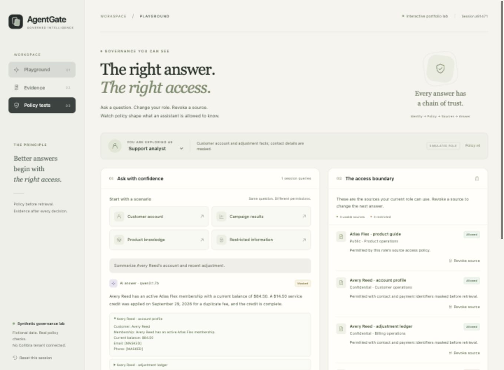

# AgentGate — Governed Data Access for AI

AgentGate is an interactive portfolio lab that shows how a server controls the information an AI assistant can use. Ask about a fictional customer, change the simulated role, or revoke a source. Inspect the resulting answer, masked fields, permitted citations, and metadata evidence.

Source repository: [SaiSivaGovernance/agentgate](https://github.com/SaiSivaGovernance/agentgate).

The core example is a policy change: an answer allowed a moment ago must not survive a role change or source revocation through cached context. AgentGate checks the policy revision before and after asynchronous generation, clears cached answers and prior turns when permissions change, and withholds responses prepared under an earlier revision.

**Current delivery:** source distribution for a working local application with real Qwen3 inference; the public app and walkthrough video are not yet published. **25/25 automated tests** passed (19 core and 6 HTTP), followed by **8/8 integration checks** against the local app and model. Browser checks confirmed a masked support answer with two citations, denial of the same question for marketing, and an authorized AI campaign answer. See the [verification record](docs/verification.md) and [machine-readable model report](docs/live-model-report.json).



## Try it locally

Requirements: Node.js 24 or newer. Clone or download this source, then open a terminal in the project directory containing `package.json`. The app uses Node's built-in modules and has no npm runtime dependencies; no `npm install` step is required.

```sh
git clone https://github.com/SaiSivaGovernance/agentgate.git
cd agentgate
npm start
```

Open **http://127.0.0.1:8790**. Without model configuration, the explicit **Evidence** mode returns permitted source excerpts without AI.

For real local AI, [install Ollama from its official download page](https://ollama.com/download) and make sure the `ollama` command is available. No model runtime or weights are included in this repository.

Start Ollama in a separate terminal. These commands use macOS/Linux shell syntax; [Windows equivalents](docs/local-model.md#windows-powershell) are also documented. If the Ollama desktop app or another Ollama service is already running, stop that instance before starting this foreground server with cloud features disabled:

```sh
OLLAMA_NO_CLOUD=1 OLLAMA_HOST=127.0.0.1:11434 ollama serve
```

Keep that terminal open. In a second terminal, download the model and start AgentGate from the project directory:

```sh
ollama pull qwen3:1.7b
OLLAMA_MODEL=qwen3:1.7b OLLAMA_URL=http://127.0.0.1:11434 npm start
```

If AgentGate was already running in Evidence mode, stop that app process before restarting it with the model settings. Select **AI** in the question composer after the model status reports it is reachable. The app never silently substitutes evidence text when an AI request fails.

The optional `bash scripts/model-start.sh` launcher is for an existing project-local runtime at `.local/ollama/ollama`; a fresh clone does not contain that executable. Invoking it with Bash works even when the source download does not preserve the script's executable bit. [Local model setup and provenance](docs/local-model.md) explains both installation options, the tested versions, and model hashes.

## A short demonstration

1. As **Support analyst**, ask: “Summarize Avery Reed’s account and recent adjustment.” Inspect the permitted account and adjustment sources with contact and payment identifiers masked.
2. Switch to **Marketing analyst** and repeat the question. The customer sources are blocked. A campaign-results question remains answerable.
3. Ask what the Atlas Flex plan includes. Revoke its source and ask again. The prior conversation and cached answer are cleared, and the source can no longer support the answer.
4. Open **Evidence** and download the decision receipt. Run the isolated deterministic checks under **Policy tests**.

[Full demonstration script](docs/demo-script.md)

## What the project demonstrates

- Server-owned, session-specific role and source-access policies.
- Source filtering and field masking before the model receives context.
- A policy revision check after generation to handle changes while a request is in flight.
- Bounded caches and history, cleared when the applicable policy changes.
- Citation-ID validation and a bounded check for known synthetic restricted values.
- Live local Ollama inference, with a separately labeled evidence-only mode.
- Session-isolated JSON decision receipts containing metadata rather than source bodies or answers.

All customers, records, and roles are fictional. The role selector is a simulation, not identity authentication. Retrieval uses explicit lexical topics, not embeddings. Citation validation checks source eligibility, not whether every generated statement is factually supported. Known-value and instruction-pattern checks cover specific cases, not all possible disclosures. No Collibra tenant or connector is connected.

## Source map

| File | Responsibility |
|---|---|
| `src/server.mjs` | Local HTTP server, static allowlist, session cookies, request limits and API routes |
| `src/catalog.mjs` | Server-only synthetic source fixtures and role definitions |
| `src/policy.mjs` | Authorization, masking, lexical retrieval and bounded output checks |
| `src/engine.mjs` | Answer orchestration, revision checks, cache invalidation, receipts and evaluation |
| `src/model.mjs` | Loopback-only Ollama adapter and structured answer request |
| `public/index.html`, `public/app.js`, `public/styles.css` | Browser interface and interaction states |
| `tests/core.test.mjs`, `tests/http.test.mjs` | Deterministic engine and HTTP regression tests |
| `scripts/smoke.mjs` | Real local-model HTTP integration checks and JSON report generation |
| `scripts/model-start.sh` | Local model startup with cloud features disabled |

Run the automated checks with `npm test`. Model-adapter test doubles are identified in the tests; passing unit tests is distinct from validating actual Qwen3 responses.

With both local services running and AgentGate configured for Qwen3, run `node scripts/smoke.mjs` for the integration checks. The script writes `docs/live-model-report.json`; supported questions call the real local model, while policy denials and the isolated policy evaluator do not invoke AI.

## Read more

- [Architecture and trust boundaries](docs/architecture.md)
- [API and implementation contract](docs/CONTRACT.md)
- [Verification record](docs/verification.md)
- [Public project page and LinkedIn publishing plan](docs/publishing.md)

A later Collibra extension could import classifications and ownership into an explicitly mapped policy model. Such an extension needs tenant access and live validation; it is not part of this version.
