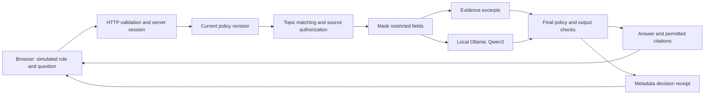

# Architecture

AgentGate is a Node.js application bound to `127.0.0.1:8790`, with a static browser interface and a local Ollama service at `127.0.0.1:11434`. There is no database, vector store, remote model, identity provider, or Collibra connection in this version.

## Answer flow

1. The server validates the request's origin, media type, size, accepted fields and session. A question can provide only `question` and `mode`; it cannot supply its own role, policy, or source context.
2. The engine captures the server-owned role and policy revision. It matches question words to explicit source topics, authorizes matching sources, and replaces restricted field values with `[MASKED]` before constructing visible excerpts.
3. **Evidence mode** returns permitted excerpts. **AI mode** sends only the current question and permitted, masked excerpts to the configured local model. Previous conversation turns are never added to the model context. The adapter accepts only loopback origins and refuses redirects.
4. The model is asked for a structured JSON answer with citation IDs. The engine checks format, citation membership and known restricted fixture values.
5. The engine checks the current role and policy revision again before returning the answer. A change during generation causes the pending content and citations to be discarded. A reset also advances the revision, preventing reuse of an earlier revision number.
6. The app returns the answer, permitted citation excerpts, and a metadata receipt. An unavailable or malformed AI response is explicitly withheld; it is not replaced with an unlabeled deterministic answer.

## State and revocation

The browser receives an opaque `HttpOnly`, `SameSite=Strict` session cookie. Role changes, source revocations and restorations operate on that session only. The role selector intentionally allows visitors to explore all three fictional roles; it does not authenticate real people.

The cache key includes policy revision, role, question and answer mode. A role or source-access change increments the revision and clears all prior turns and cached answers. Metadata receipts remain so a visitor can compare the decisions. Restoring a source requires a fresh answer under the new revision.

The current limits are 100 receipts, 12 visible turns and 32 cached answers per session. The HTTP server permits up to 100 sessions, expires idle sessions after 30 minutes, and stores everything in memory. A restart clears session state. Reset removes the session's receipts, turns, revocations and cache. Revocation controls subsequent access; it cannot retract information a visitor has already read or downloaded.

## Catalog and access model

| Source | Permitted role | Field behavior |
|---|---|---|
| Atlas Flex product guide | All three simulated roles | Public fixture fields |
| Avery Reed account profile | Support analyst | Email and phone masked |
| Avery Reed adjustment ledger | Support analyst | Payment reference masked |
| Autumn Atlas campaign results | Marketing analyst | Aggregate results only |
| Stewardship register | Data steward | Governance metadata and policies |
| Settlement vault | None | Source content denied |

Classification and ownership are visible catalog metadata in this fictional lab. Stewardship does not imply access to customer business records. Fixture content is server-side and excluded from the HTTP static-file allowlist. The source distribution includes these fictional fixtures for reproducibility; they are not real secrets.

## API surface

All API responses are JSON with `Cache-Control: no-store`. POST requests require the application's origin and `application/json`. Question length is 1–800 characters, request bodies are limited to 4 KiB, and unknown body fields are rejected.

| Method and path | Request | Result |
|---|---|---|
| `GET /api/health` | None | Lab and configured-model status |
| `GET /api/session` | Session cookie if present | Role, revision, catalog metadata, history and status |
| `POST /api/role` | `{ "role": "support" }` | Updated session; roles: `support`, `marketing`, `steward` |
| `POST /api/access` | `{ "documentId": "atlas-plan", "revoked": true }` | Updated session and policy revision |
| `POST /api/reset` | `{}` | Reset session with a newer revision |
| `POST /api/ask` | `{ "question": "What does Atlas Flex include?", "mode": "ai" }` | `turn`, `receipt`, and session snapshot; mode can also be `evidence` |
| `GET /api/evidence/:id` | Current session cookie | Downloadable receipt, or 404 outside its session |
| `POST /api/evaluate` | `{}` | Isolated deterministic policy cases and measured pass count |

The HTTP server allows 20 questions per minute per session, one pending answer per session, and two concurrent question requests across the process. These are modest local-demo limits, not a distributed service quota design. Full response shapes are documented in [CONTRACT.md](CONTRACT.md).

## Evidence and limits

Receipts record the decision, role, revision, model label, question hash, source IDs, masked field names, checks, cache event and measured latency. They omit the question, generated answer and source text. A question hash is a reproducibility aid, not an anonymization guarantee. Current turns and answer caches still contain permitted question/answer content until invalidated or expired.

The disclosure check looks for normalized known values in this small fixture catalog. The request filter recognizes a bounded set of unsupported instruction patterns. Neither proves resistance to arbitrary prompt injection, paraphrased disclosures or facts present in model training. Citation validation does not establish factual entailment. The data is synthetic, so the project evaluates implementation behavior rather than protection of an actual enterprise system.

There is no claim of production identity security, regulatory certification, or Collibra integration. The most important enforcement boundary is source authorization and masking before the model call; the model never decides its own permissions.
